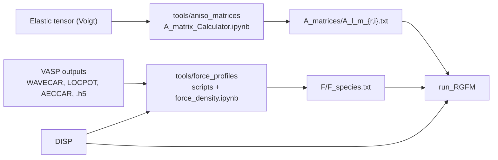

# RGFM

[](https://github.com/g-gengor/RGFM/actions/workflows/ci.yml)

RGFM computes the continuum displacement field around crystal defects from
quantum-mechanical force densities. It uses the anisotropic elastic Green's
function written as a spherical-harmonic expansion, and for dislocations it
adds the contributions of periodic images along the dislocation line. This
connects first-principles (DFT) calculations to anisotropic continuum
elasticity: the long-range strain field of a defect follows from the
quantum-mechanical forces computed near its core.

This is the C++ reference implementation for:

- G. Gengor, O. K. Celebi, A. S. K. Mohammed, H. Sehitoglu, **"Continuum strain
  of point defects,"** *Journal of the Mechanics and Physics of Solids* 188,
  105653 (2024). [doi:10.1016/j.jmps.2024.105653](https://doi.org/10.1016/j.jmps.2024.105653)
- Dislocation paper, *Physical Review Materials* (2025).
  **[TODO: add title, authors and DOI]** <!-- TODO(PRM-2025): fill in the citation and DOI link -->

<!-- TODO(figure): add docs/figure.png, then uncomment the next line.

-->

## Repository layout

```
CMakeLists.txt       build configuration (produces bin/run_RGFM)
src/                 C++ sources
  run_RGFM.cpp         command-line entry point
  RGFM_parser.*        reads RGFM_config and dispatches to the solvers
  Greens_PWexpansion.* Green's function expansion, image sums and solvers
  build_run_RGFM.sh    convenience wrapper around CMake
  test_parser.cpp      small parser test driver (not built by default)
test_p1h/            example: solve for H (reference: H_truth.txt)
test_p1grid/         example: displacement field on a grid (reference: US/U_truth)
scripts/             run_tests.sh (regression tests), compare_outputs.py
tools/               Python pre-processing: A matrices and force profiles from VASP
```

## Dependencies

- A C++14 compiler (GCC or Clang) and CMake >= 3.16
- [Eigen](https://eigen.tuxfamily.org) (header-only; tested with 3.4.0 and 5.0.1)
- [Boost](https://www.boost.org) headers, for Boost.Math spherical harmonics and
  barycentric rational interpolation (tested with 1.83)
- POSIX threads

Ubuntu / Debian:

```bash
sudo apt install build-essential cmake libeigen3-dev libboost-dev
```

macOS (Homebrew):

```bash
brew install cmake eigen boost
```

On Apple silicon, Eigen 5 needs a reasonably recent Apple Clang. If the build
fails inside Eigen's NEON code (for example `use of undeclared identifier
'vcmla_f32'`), update the Xcode Command Line Tools, or use Eigen 3 instead:
`brew install eigen@3` and add `-DCMAKE_PREFIX_PATH=$(brew --prefix eigen@3)`
to the configure command below.

## Build

```bash
cmake -S . -B build          # Release (-O2) by default
cmake --build build --parallel
# -> bin/run_RGFM
```

`src/build_run_RGFM.sh` runs the same two commands. If Eigen or Boost are
installed in a non-standard location, pass `-DCMAKE_PREFIX_PATH=<prefix>` (or
`-DBoost_ROOT=<boost source tree>` for a plain Boost download).

## Quick start

The two bundled test cases are a dislocation system with three species (C, Si,
N), 372 atoms, `L_MAX 8` and 44 periodic images on each side.

```bash
scripts/run_tests.sh grid   # displacement field on a 3-point grid, ~10 s
scripts/run_tests.sh h      # solve the dense 1116x1116 system for H, ~12 min on 4 threads
scripts/run_tests.sh        # both
```

The script copies each case to a temporary directory, runs it there, and
compares the result against the stored reference (`US/U_truth`, `H_truth.txt`).
CI runs the grid case on every push; the H case can be triggered manually from
the Actions tab.

To run a case by hand, run `run_RGFM` from inside the case directory. It reads
all inputs from its working directory and writes its outputs there, which
overwrites the copies stored in the repository:

```bash
cd test_p1grid
../bin/run_RGFM 128         # reads GRIDS/GRID_128, writes US/U_128
```

## Usage

```
run_RGFM [n]
```

Run it from a directory containing `RGFM_config` and the input files listed
below. The optional integer `n` (default 0) is used in `GRID` mode only: it
selects the grid file `GRIDS/GRID_<n>` and the output file `US/U_<n>`. This
lets you split a large grid into several files and run them as independent
jobs. In `H` mode `n` is ignored.

### `RGFM_config` tags

One tag per line, followed by its value(s). Example (`test_p1grid/RGFM_config`):

```
PERIODIC_DIM 1
L_MAX 8
MAX_IMAGES 44
SPECIES 3 C Si N
PERIODIC_VECS 3.062 0.0 0.0
THREAD_NUM 4
PROBLEM GRID
```

| Tag | Default | Description |
|---|---|---|
| `PERIODIC_DIM` | 0 | Dimension of periodicity: 1 for dislocations, 0 for point defects. Only 1 is currently implemented (see [roadmap](#limitations--roadmap)). |
| `L_MAX` | 8 | Maximum degree l of the spherical harmonic expansion (only even l contribute). 8 is sufficient for 4H-SiC. The A matrices and force profiles must cover every even l up to `L_MAX`. |
| `MAX_IMAGES` | 0 | Number of periodic images on each side of the cell along the periodic vector (images -n...+n). Used for dislocations; irrelevant for point defects. |
| `SPECIES` | *required* | Number of species followed by their names, e.g. `SPECIES 3 C Si N`. The order defines the species index used in `DISP` (C = 1, Si = 2, N = 3) and the force profile file names (`F/F_C.txt`, ...). |
| `PERIODIC_VECS` | 0 | Vector(s) along which the system is periodic, e.g. `PERIODIC_VECS 3.062 0.0 0.0` for a dislocation line along x. Up to three vectors can be given on the same line (9 numbers), but only the first one is used so far. |
| `THREAD_NUM` | 1 | Number of threads for the parallel loops. |
| `PROBLEM` | *required* | `H` solves for the H scaling vectors of the given configuration; `GRID` evaluates the displacement field on a grid using an existing `H.txt`. |

### Input files

All files are plain whitespace-separated text. Every file must end with a
single newline and contain no blank lines (see
[limitations](#limitations--roadmap)). Positions, displacements and the
anisotropy tensors must all be expressed in the same coordinate system.

| File | Mode | Content |
|---|---|---|
| `RGFM_config` | both | Configuration, see above. |
| `DISP` | both | Atomic positions and displacements, see [below](#disp). |
| `A_matrices/A_<l>_<m>_r.txt`, `A_matrices/A_<l>_<m>_i.txt` | both | Real and imaginary parts of the 3x3 anisotropy matrix A<sub>lm</sub>, for every even l = 0, 2, ..., `L_MAX` and m = 0, ..., l. Generated by [`tools/aniso_matrices`](tools/aniso_matrices/README.md). |
| `F/F_<species>.txt` | both | Force profile of each species, see [below](#force-profiles). Generated by [`tools/force_profiles`](tools/force_profiles/README.md). |
| `H.txt` | `GRID` | H scaling vectors written by an `H` run: 3N values (x, y, z for each atom, in `DISP` order), one per line. |
| `GRIDS/GRID_<n>` | `GRID` | Mx3 matrix of the points at which the displacement is evaluated. |

#### `DISP`

An Nx8 matrix, one row per atom (N atoms):

| Column | Content |
|---|---|
| 0 | Atom ID. Not used by RGFM. |
| 1 | Species index, starting from 1, in the order given by the `SPECIES` tag. |
| 2, 3, 4 | Displaced position of the atom. |
| 5, 6, 7 | Displacement vector of the atom. |

#### Force profiles

`F/F_<species>.txt` is a matrix with `L_MAX/2 + 2` (or more) columns. Column 0
holds the radial distance r in ascending order, and column k + 1 holds the
profile F<sub>l</sub>(r) for l = 2k (columns 1-5 are l = 0, 2, 4, 6, 8 for
`L_MAX 8`). RGFM interpolates linearly between the tabulated points, uses the
first value for r below the table, and uses zero beyond its last point.

### Outputs

| Mode | File | Content |
|---|---|---|
| `H` | `H.txt` | The solved H scaling vectors (3N values). |
| `H` | `solve4.txt` | The 3N target displacement vector read from `DISP`, for reference. |
| `GRID` | `US/U_<n>` | Mx3 displacement vectors at the points of `GRIDS/GRID_<n>`. The `US/` directory must already exist. |

## Pre-processing tools

The Python tools in [`tools/`](tools/README.md) produce the RGFM inputs from DFT
(VASP) calculations and the elastic constants of the bulk material:



- **`tools/aniso_matrices`**: computes the anisotropy matrices A<sub>lm</sub>
  of the spherical-harmonic Green's function expansion (Eq. 10 of the JMPS
  paper) from the bulk elastic tensor.
- **`tools/force_profiles`**: computes the quantum-mechanical force density
  (kinetic, electrostatic and exchange-correlation contributions; Section 2.2
  of the JMPS paper) from VASP output and averages it into per-species profiles.

Install the Python dependencies with `pip install -r tools/requirements.txt`.
The kinetic-stress script also needs
[VaspBandUnfolding](https://github.com/QijingZheng/VaspBandUnfolding), which is
installed separately.

## Limitations / roadmap

- **Point defects.** The `RGFM_config` driver only handles dislocations
  (`PERIODIC_DIM 1`). Solvers for isolated defects exist in
  `Greens_PWexpansion` (`solve_h`, `solve4grid`) but are not yet wired up; a
  config with `PERIODIC_DIM 0` currently runs nothing.
- **Higher periodicity.** Image sums are implemented along a single periodic
  vector. Extra periodic vectors (2D/3D periodicity) are planned and would be
  added to the `PERIODIC_VECS` line.
- **Input handling.** Inputs are read relative to the working directory. A
  missing input file is not reported: the program hangs while reading it, so
  check paths first if it stalls after `reading ...`. Blank lines, including
  an extra trailing newline, are counted as matrix rows. Each input file may
  hold at most 10<sup>6</sup> numbers.
- **Scaling.** `H` mode builds and factorizes a dense 3N x 3N system (full
  pivoting LU), so its cost grows quickly with the number of atoms.

## Citation

If you use RGFM, please cite:

```bibtex
@article{Gengor_2024,
  title     = {Continuum strain of point defects},
  author    = {Gengor, G. and Celebi, O. K. and Mohammed, A. S. K. and Sehitoglu, H.},
  journal   = {Journal of the Mechanics and Physics of Solids},
  volume    = {188},
  pages     = {105653},
  year      = {2024},
  month     = jul,
  publisher = {Elsevier BV},
  issn      = {0022-5096},
  doi       = {10.1016/j.jmps.2024.105653},
  url       = {https://doi.org/10.1016/j.jmps.2024.105653}
}
```
